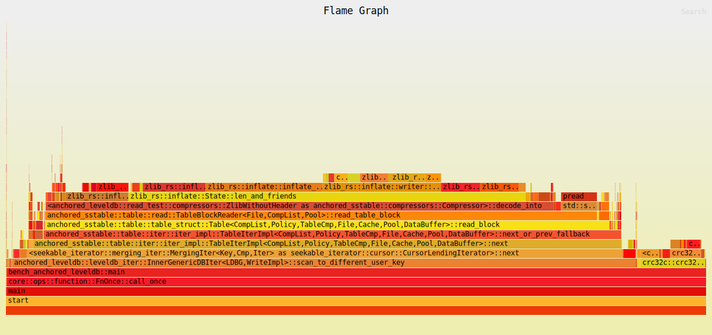
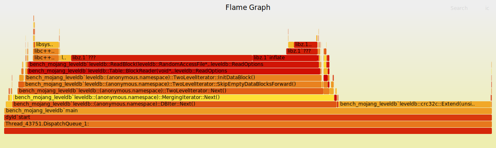
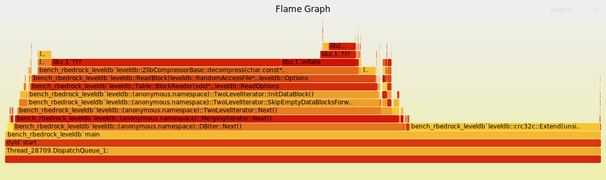
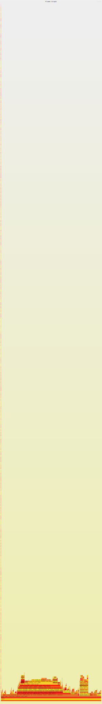

# Benchmark

The following benchmark consisted of sequentially reading through all key-value entries of a
Minecraft: Bedrock Edition world's LevelDB database, which was 1 gigabyte in size and contained
5&thinsp;001&thinsp;126 total entries. The benchmark counted the number of entries and computed the
crc32c checksum of all the keys and values (in order).

The benchmark could not be run on Google's `leveldb` due to its lack of support for the Zlib
compression used by the MCBE world's database.

## Environment

The Rust implementations (`anchored-leveldb` and `rusty-leveldb`) were compiled using rustc v1.90.0
(1159e78c4 2025-09-14) in release mode with link-time optimization enabled, in addition to
`-C target-cpu=native -C llvm-args=-enable-dfa-jump-thread` flags.

The C++ implementations (`mojang-leveldb` and `rbedrock-leveldb`) were compiled with Apple clang
v17.0.0 (clang-1700.4.4.1, targeting arm64-apple-darwin24.6.0) with link-time optimization enabled
and runtime type information disabled, in addition to `-O3 -march=native -std=c++17` flags.

The benchmarks were performed on a 2021 MacBook Pro with 16GB of RAM running macOS v15.6.1.

## Execution

The machine was restarted after compiling the benchmarks and before running them, in order to clear
out RAM and reduce memory pressure. Each implementation was run 3 times in short succession in
order to account for caching. All 12 runs of the LevelDB implementations yielded the correct total
of 5&thinsp;001&thinsp;126 entries and the correct checksum of 2148847350.

During the benchmarks, macOS's Activity Monitor was examined to ensure that memory pressure did
not substantially impact the running times. The memory pressure indicator remained green during all
but `rusty-leveldb`'s benchmark, in which memory pressure briefly reached a yellow level. No swap
space was used during any benchmark, and the laptop was plugged in to a power adapter to avoid
throttling the CPU's power usage.

After all benchmarks were performed, flamegraphs for the Rust implementations were captured with
`flamegraph v0.6.10` while flamegraphs for the C++ implementations were captured with the `sample`
utility of zsh v5.9 (arm64-apple-darwin24.0).

# Results

## Real Running Times

All results are the `real` running time in seconds, as reported by the `time`
utility of zsh v5.9 (arm64-apple-darwin24.0).

|                    |    1    |    2    |    3    |
| ------------------ | ------- | ------- | ------- |
| `anchored-leveldb` |  4.871  |  4.398  |  4.473  |
| `mojang-leveldb`   |  6.753  |  4.645  |  4.726  |
| `rbedrock-leveldb` |  8.050  |  4.560  |  4.537  |
| `rusty-leveldb`    | 12.792  | 12.505  | 12.496  |

## User and Sys Running Times

Results are the `user` and `sys` running times in seconds, as reported by the `time`
utility of zsh v5.9 (arm64-apple-darwin24.0).

|                    | 1 (user) | 2 (user) | 3 (user) | 1 (sys) | 2 (sys) | 3 (sys) |
| ------------------ | -------- | -------- | -------- | ------- | ------- | ------- |
| `anchored-leveldb` |   3.834  |   3.816  |   3.822  |  0.312  |  0.246  |  0.242  |
| `mojang-leveldb`   |   4.569  |   4.494  |   4.540  |  0.262  |  0.104  |  0.104  |
| `rbedrock-leveldb` |   4.601  |   4.396  |   4.366  |  0.502  |  0.097  |  0.091  |
| `rusty-leveldb`    |   9.832  |   9.538  |   9.638  |  2.098  |  1.990  |  1.861  |

## Flamegraphs

### `anchored-leveldb`

### `mojang-leveldb`

### `rbedrock-leveldb`

### `rusty-leveldb`

## Analysis

The first column is derived from the benchmark, and the remaining three columns are calculated
from percentages from the interactive flamegraphs. The fourth column is the quotient of the third
and second columns.

|                    | Real Runtime   (average of runs 2 and 3) | Time spent in   LevelDB implementation | Time spent   decompressing data | Percent of LevelDB implementation   spent decompressing data |
| ------------------ | -------- | -------- | -------- | ------- |
| `anchored-leveldb` |  4.4355  |  89.01%  |  72.59%  |  81.55% |
| `mojang-leveldb`   |  4.6855  |  68.24%  |  50.84%  |  74.50% |
| `rbedrock-leveldb` |  4.5485  |  67.51%  |  51.62%  |  76.46% |
| `rusty-leveldb`    | 12.5005  |  86.39%  |  29.04%  |  33.62% |

## Discussion
As the percentage of the LevelDB implementations' time spent performing decompression was above 74%
for all but `rusty-leveldb`, these results show that the compression used by Minecraft: Bedrock is
expensive to the point that the other optimizations to the LevelDB algorithm discussed above can
only amount to at most 20% improvement to the current state of `anchored-leveldb`. The most feasible
way to improve the speed of the CPU-heavy decompression task is by splitting the work across
multiple CPU cores. Indeed, it turns out that RocksDB supports the ability to prefetch data blocks
and decompress them in parallel. While the other adjustments in `anchored-leveldb` may be useful for
single-threaded programs, sequential access to the database would greatly benefit from decompressing
data in parallel.

The `rusty-leveldb` benchmark shows that `rusty-leveldb` is significantly slower than the other
three implementations; additionally, its flamegraph is unreasonably tall due to its use of a
recursive destructor for a linked list structure. The other three benchmarks should not be taken as
implying that `anchored-leveldb` is genuinely faster; due to the below limitations, these results
merely show that the `anchored-leveldb` prototype has competitive performance.

## Limitations
Given that a high percentage of time was spent performing Zlib compression and crc32c checksums,
the benchmarks are heavily influenced by the Zlib and crc32c implementations used. Judging by the
flamegraphs, the system's Zlib decompressor (`libz` v1.2.12), used by `mojang-leveldb` and
`rbedrock-leveldb`, is faster than the `zlib-rs` decompressor (`zlib-rs` v0.5.2) used by
`anchored-leveldb` and `rusty-leveldb`, while the crc32c implementation (`crc32c` v0.6.8) used by
`anchored-leveldb` and `rusty-leveldb` is faster than the crc32c implementation written by Google
and used by `mojang-leveldb` and `rbedrock-leveldb`.

Additionally, `anchored-leveldb` was not performing automatic compactions, while the other three
implementations do not support an option to disable automatic compactions. While the flamegraphs do
not show any substantial time being spent on performing compactions, simply checking whether an
automatic compaction should be performed may cost some time, giving `anchored-leveldb` a
perhaps-unfair advantage.

Lastly, the C++ and Rust implementations necessarily used different compilers. While both clang and
rustc use LLVM as their codegen backend, there are surely differences in optimizations applied by
the compilers, and there may be compilation flags which would dredge up better performance. The
default memory allocator used by Rust and C++ programs are also somewhat different. While similar
compilation flags were passed to clang and rustc, these results depend on the compilers' defaults
and optimizations in addition to any merits of the four LevelDB implementations themselves.
